[](https://github.com/cagatay-softgineer/SpotifySDK-Research/actions/workflows/github-code-scanning/codeql)
[](https://github.com/cagatay-softgineer/SpotifySDK-Research/actions/workflows/qa.yml)
[](https://github.com/cagatay-softgineer/SpotifySDK-Research/actions/workflows/code-security.yml)
# SpotifySDK-Research
 
# Pomodro Backend Server 

Pomodro Backend Server provides the core backend services for the Pomodro mobile application. It handles user authentication and registration, integration with external music APIs (Spotify, Apple Music, YouTube Music, Google API, Musixmatch), app linking, user profile management, logging, error handling, and various utility endpoints. Feel free to adjust sections as needed. 

## Table of Contents 

- [Overview](#overview) 
- [Features](#features) 
- [Architecture](#architecture) 
- [Directory Structure](#directory-structure) 
- [Setup & Installation](#setup--installation) 
- [Configuration](#configuration) 
- [Running the Server](#running-the-server) 
- [API Endpoints](#api-endpoints) 
- [Development & Testing](#development--testing) 
- [Contributing](#contributing) 
- [License](#license) 

## Overview 

The Pomodro Backend Server is a modular Python-based server designed to support a feature-rich mobile application. It is built with Flask (and supporting libraries) and integrates with Firebase for storage and authentication. The server comprises multiple services: 
- **Authentication Service** – Handles user registration, login, JWT token generation and refresh. 
- **App Linking Service** – Manages linking user accounts with external music services. 
- **Music Integration Services** – Integrates with external APIs such as Spotify, Apple Music, YouTube Music, and Google API. 
- **Lyrics Service** – Retrieves lyrics using Musixmatch API. 
- **User Profile Service** – Manages user profile data. 
- **Utility Services** – Provides features like endpoint listing, log visualization, and analytics. 
- **Error Logging & Authorization** – Offers comprehensive error logging and scope-based endpoint authorization. 

## Features 

- **User Authentication & Registration:** Secure JWT-based authentication with token refresh. 
- **App Linking & External Integrations:** Connects mobile users with various music providers. 
- **Music API Integrations:** Fetches user profiles, playlists, and tracks from Spotify, Apple Music, YouTube Music, and Google APIs. 
- **Lyrics Fetching:** Integrates with Musixmatch to retrieve song lyrics. 
- **User Profile Management:** Provides endpoints for viewing and updating user profiles. 
- **Logging and Error Handling:** Robust logging, error capturing, and endpoint monitoring. 
- **Utility Endpoints:** Includes endpoints for listing available API routes and visualizing logs. 

## Architecture 

The backend is organized into several service modules grouped by functionality. The architecture leverages a layered approach, dividing the system into client, backend core, authentication, app linking, external integrations, and utility modules. 

### High-Level Architecture Diagram (C4 Container Diagram) 

```mermaid 
%%{init: {'flowchart': {'orientation': 'LR'}}}%% 
C4Container 
  title Full Container Diagram for Pomodro Project (Mobile & Backend) 

  %% Client Layer with Mobile App 
  Person(user, "User", "End-user using the Mobile App", $tags="core") 
  Container_Boundary(client, "Client Layer") { 
      Container(mobile_app, "Mobile App", "React Native / Swift / Kotlin", "The primary mobile interface", $tags="client") 
  } 
  
  %% Core Backend Services 
  Container_Boundary(bc, "Backend Core") { 
      Container(server_py, "Server (server_py)", "Python", "Core backend orchestration", $tags="backend") 
      Container(firebase_ops_py, "Firebase Ops", "Python", "Manages database & user records", $tags="backend") 
  } 
  
  %% Authentication 
  Container_Boundary(auth, "Authentication Service") { 
      Container(auth_py, "Auth Service", "Python", "Processes authentication and token generation", $tags="auth") 
      Container(register, "Register", "Python", "Handles user registration", $tags="auth") 
      Container(login, "Login", "Python", "Processes user login", $tags="auth") 
      Container(refresh, "Refresh Token", "Python", "Renews tokens", $tags="auth") 
  } 
  
  %% App Linking 
  Container_Boundary(app_link, "App Linking Service") { 
      Container(apps_py, "Apps", "Python", "Manages linking external music services", $tags="link") 
      Container(check_link, "Check Link", "Python", "Verifies linkage", $tags="link") 
      Container(unlink, "Unlink App", "Python", "Handles unlinking process", $tags="link") 
      Container(all_bind, "All Bindings", "Python", "Retrieves linked apps", $tags="link") 
  } 
  
  %% Music Integration Services 
  Container_Boundary(spotify, "Spotify Service") { 
      Container(spotify_py, "Spotify", "Python", "Handles Spotify operations", $tags="spotify") 
      Container(spotify_login, "Spotify Login", "Python", "Manages Spotify OAuth", $tags="spotify") 
      Container(spotify_callback, "Spotify Callback", "Python", "Processes OAuth callback", $tags="spotify") 
      Container(spotify_playlists, "Spotify Playlists", "Python", "Manages playlists", $tags="spotify") 
      Container(spotify_user, "Spotify User", "Python", "Fetches user info", $tags="spotify") 
  } 
  
  Container_Boundary(apple, "Apple Music Service") { 
      Container(apple_py, "Apple", "Python", "Handles Apple Music operations", $tags="apple") 
      Container(apple_login, "Apple Login", "Python", "Manages Apple OAuth", $tags="apple") 
      Container(apple_callback, "Apple Callback", "Python", "Processes callback", $tags="apple") 
      Container(apple_playlists, "Apple Playlists", "Python", "Manages playlists", $tags="apple") 
      Container(apple_library, "Apple Library", "Python", "Accesses music library", $tags="apple") 
  } 
  
  Container_Boundary(yt, "YouTube Music Service") { 
      Container(youtube_music_py, "YouTube Music", "Python", "Core operations for YouTube Music", $tags="yt") 
      Container(yt_playlists, "YT Playlists", "Python", "Fetches playlists", $tags="yt") 
      Container(yt_tracks, "YT Tracks", "Python", "Retrieves track details", $tags="yt") 
      Container(yt_duration, "YT Duration", "Python", "Calculates durations", $tags="yt") 
  } 
  
  Container_Boundary(google, "Google API Service") { 
      Container(google_api_py, "Google API", "Python", "Handles Google API calls", $tags="google") 
      Container(google_bind, "Google Bind", "Python", "Binds Google accounts", $tags="google") 
      Container(google_callback, "Google Callback", "Python", "Processes callback", $tags="google") 
      Container(google_profile, "Google Profile", "Python", "Fetches profile data", $tags="google") 
  } 
  
  %% Support Services 
  Container_Boundary(lyrics, "Lyrics Service") { 
      Container(lyrics_py, "Lyrics", "Python", "Processes lyric data", $tags="lyrics") 
      Container(get_lyrics, "Get Lyrics", "Python", "Fetches lyrics from Musixmatch", $tags="lyrics") 
  } 
  Container_Boundary(profile, "User Profile Service") { 
      Container(user_profile_py, "User Profile", "Python", "Manages user profiles", $tags="profile") 
      Container(view_profile, "View Profile", "Python", "Displays profile information", $tags="profile") 
  } 
  Container_Boundary(util, "Utility Services") { 
      Container(utilx_py, "Utility", "Python", "General utilities", $tags="util") 
      Container(visualize_logs, "Visualize Logs", "Python", "Displays logs", $tags="util") 
      Container(logs_trend, "Logs Trend", "Python", "Generates trend charts", $tags="util") 
      Container(endpoints, "List Endpoints", "Python", "Lists API endpoints", $tags="util") 
  } 
  Container_Boundary(err, "Error Logger") { 
      Container(error_py, "Error Logger", "Python", "Logs application errors", $tags="error") 
      Container(error_handling_py, "Error Handling", "Python", "Manages error processing", $tags="error") 
      Container(logger_py, "Logger", "Python", "Central logging", $tags="error") 
  } 
  Container_Boundary(authz, "Authorization Module") { 
      Container(authlib_py, "AuthLib", "Python", "Provides authorization utilities", $tags="authz") 
      Container(requires_scope, "Requires Scope", "Python", "Validates JWT scopes", $tags="authz") 
  } 
  Container_Boundary(ext, "External APIs") { 
      Container(spotify_ext, "Spotify API", "External", "External Spotify service", $tags="ext") 
      Container(apple_ext, "Apple API", "External", "External Apple service", $tags="ext") 
      Container(google_ext, "Google API", "External", "External Google service", $tags="ext") 
      Container(musixmatch_ext, "Musixmatch API", "External", "External lyrics service", $tags="ext") 
      Container(youtube_ext, "YouTube API", "External", "External YouTube service", $tags="ext") 
  } 

  UpdateLayoutConfig($c4ShapeInRow="3", $c4BoundaryInRow="15") 
``` 


## Directory Structure 

Below is a sample directory structure for the project: 

``` 
server/
├── .bandit
├── Blueprints/
│   ├── __init__.py
│   ├── apple.py
│   ├── apple_music.py
│   ├── apps.py
│   ├── auth.py
│   ├── error.py
│   ├── google_api.py
│   ├── lyrics.py
│   ├── spotify.py
│   ├── spotify_micro_service.py
│   ├── user_profile.py
│   ├── utilx.py
│   └── youtube_music.py
├── Dockerfile
├── __init__.py
├── bandit.yaml
├── config/
│   ├── __init__.py
│   └── config.py
├── database/
│   ├── __init__.py
│   └── firebase_operations.py
├── helper/
│   └── error.py
├── requirements.txt
├── run_on_waitress.py
├── run_server.bat
├── server.py
├── static/
│   ├── icon/
│   ├── style.css
│   └── swagger.json
├── templates/
│   ├── apple.html
│   ├── apple_login.html
│   ├── endpoint.html
│   ├── error.html
│   ├── google.html
│   ├── index.html
│   ├── log.html
│   ├── open.html
│   └── spotify.html
├── tests/
│   ├── test_apple.py
│   ├── test_apps.py
│   ├── test_auth.py
│   ├── test_endpoints.py
│   ├── test_lyrics.py
│   ├── test_spotify.py
│   ├── test_spotify_micro_service.py
│   ├── test_user_profile.py
│   ├── test_utils.py
│   └── test_youtube_music.py
└── util/
    ├── __init__.py
    ├── app.py
    ├── authlib.py
    ├── blueprints.py
    ├── error_handlers.py
    ├── error_handling.py
    ├── google.py
    ├── logit.py
    ├── models.py
    ├── playlist.py
    ├── setup.py
    ├── spotify.py
    ├── utils.py
    └── youtube.py

``` 

## Setup & Installation 

1. **Clone the Repository:** 

   ```bash 
   git clone https://github.com/cagatay-softgineer/SpotifySDK-Research.git 
   cd pomodro-backend 
   ``` 

2. **Create a Virtual Environment and Install Dependencies:** 

   ```bash 
   python3 -m venv venv 
   source venv/bin/activate  # On Windows: venv\Scripts\activate 
   pip install -r requirements.txt 
   ``` 

## **Configuration:** 

   - Create and configure your `config/config.py` file with necessary settings, including: 
     - Firebase configuration 
     - API keys for Spotify, Apple Music, YouTube, Google, Musixmatch 
     - JWT and security settings 
     - Debug and production flags 

## Running the Server 

To start the backend server in development mode, run: 

```bash 
python app.py 
``` 

Or, if using a production server (e.g., Gunicorn), adjust the command accordingly: 

```bash 
gunicorn app:app -b 0.0.0.0:8000 
``` 

## API Endpoints 

The server exposes endpoints for various functionalities, for example: 

- **Authentication:** 
  - `POST /auth/register` – User registration 
  - `POST /auth/login` – User login 
  - `POST /auth/refresh` – Refresh JWT tokens 

- **App Linking:** 
  - `POST /apps/check_linked_app` – Check if a user is linked with an external app 
  - `POST /apps/unlink_app` – Unlink a previously linked app 
  - `POST /apps/get_all_apps_binding` – Retrieve all linked apps 

- **Music Services:** 
  - **Spotify:** 
    - `GET /spotify/healthcheck` 
    - `GET /spotify/callback` 
    - `POST /spotify/user_profile` 
    - `POST /spotify/playlists` 
  - **Apple Music:** 
    - `GET /apple/healthcheck` 
    - `GET /apple/callback` 
    - `POST /apple/library` 
  - **YouTube Music:** 
    - `GET /youtube_music/healthcheck` 
    - `POST /youtube_music/playlists` 
    - `POST /youtube_music/playlist_duration` 
  - **Google API:** 
    - `GET /google/healthcheck` 
    - `POST /google/google_api_bind` 
    - `GET /google/google_api_callback` 
    - `POST /google/google_profile` 

- **Profile & Utility:** 
  - `GET /profile/view` – View user profile 
  - `GET /util/logs` – Visualize logs 
  - `GET /util/endpoints` – List available API endpoints 

Additional endpoints are available for lyrics, error handling, and authorization. 

## Development & Testing 

- **Logging:**  
Logs are written to the `logs/` directory. Use the utility endpoints to visualize trends and search logs. 

- **Error Handling:**  
Custom error handling is implemented across blueprints for a robust and user-friendly experience. 

- **Testing:**  
Write your unit and integration tests as needed. Tests can be added under a `/tests` directory. 

## Contributing 

Contributions are welcome! Please follow these guidelines: 

1. Fork the repository. 
2. Create a feature branch (`git checkout -b feature-name`). 
3. Commit your changes. 
4. Push to your branch. 
5. Create a pull request. 

Ensure your code follows the project style and includes tests where applicable. 

## License 

Distributed under the MIT License. See `LICENSE` for more information. 

*This README provides an overview for developers and contributors to set up, run, and extend the Pomodro Backend Server. For further documentation on specific modules or endpoints, please refer to the inline code documentation in the source files.* 
